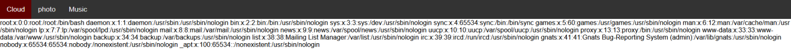
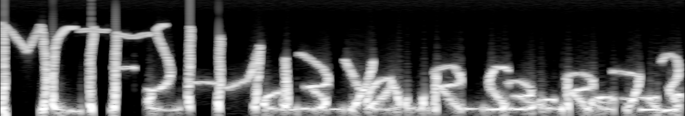

# CTF Midnight Flag : INFEKTION

## Web / Stéganographie

### Challenge : To be private or not to be private 

**Auteur :** Spownark / **Points :** 500


L'énoncé du challenge nous donne le site suivant : 
[https://cloud.midnightflag.fr/index.php](https://cloud.midnightflag.fr/index.php)

En manipulant l'URL, je m'aperçois rapidement qu'une faille LFI est exploitable.
Je commence donc à injecter un payload avec double encodage afin de récupérer le contenu du fichier **/etc/passwd** :
`https://cloud.midnightflag.fr/index.php?categorie=..%252f..%252f..%252fetc%252fpasswd`

J'ai bien le contenu du fichier en retour mais je ne vois aucun utilisateur ou service exploitable :


J'essaye par la suite d'obtenir une RCE via différents payloads LFI mais rien de concluant.

Je décide donc de télécharger le contenu du fichier index.php grâce au wrapper PHP filter :
`https://cloud.midnightflag.fr/index.php?categorie=php:%252F%252Ffilter%252Fconvert.base64-encode%252Fresource=index.php`

Avec cette requête, je récupère le contenu du fichier index.php en base64 directement sur la page web.

Après décodage, je vois le code PHP suivant correspondant aux filtres LFI appliqués (bypass de la fonction via double encodage) :
```php
    <?php
    function lfi_filter($value)
    {
        $omit_words = array('..', '../', '/');
        rsort($omit_words);
        $new_string = str_replace($omit_words, '', $value);
        return $new_string;
    }
    
    if (isset($_GET["categorie"])) {
      $categorie = lfi_filter($_GET["categorie"]);
      include urldecode($categorie);
    }else {
      include 'home.php';
    }
    ?>
```
A partir de cet instant, je cherche un petit moment avant de poursuivre le challenge car le code PHP récupéré nous donne aucune information supplémentaire.
Le fuzzing n'étant pas autorisé sur ce challenge, il est venu le temps du **#guessing** !

En regardant le nom du challenge et par rapport à la structure du site, après multiples tentatives je tente de joindre la page private.php : [https://cloud.midnightflag.fr/index.php?categorie=private.php](https://cloud.midnightflag.fr/index.php?categorie=private.php) et j'ai bien un retour !

Je récupère donc le code source de cette page avec le même payload que précédemment :
`https://cloud.midnightflag.fr/index.php?categorie=php:%252F%252Ffilter%252Fconvert.base64-encode%252Fresource=private.php`

J'obtiens le code source suivant :
```html
Source code
```
Je remarque le commentaire suivant avec des chars en ASCII : `Source code`

Après conversion, je récupère la valeur suivante : **personal**

Je suppose donc que le site possède une catégorie personal, je me rend donc sur l'URL [ https://cloud.midnightflag.fr/index.php?categorie=personal.php](https://cloud.midnightflag.fr/index.php?categorie=personal.php) et je tombe sur un enregistrement audio au format wav.

Après téléchargement de l'enregistrement, je l'ouvre avec le logiciel Audacity afin d'analyser le contenu.

L'audio généré par l'enregistrement me laisse penser qu'une information est présente dans le spectrogramme.

Après inversion de la piste audio et analyse du spectre, je récupère l'information suivante :


Flag : MCTF{H1d3_Y0uR_S3cRe7s}
